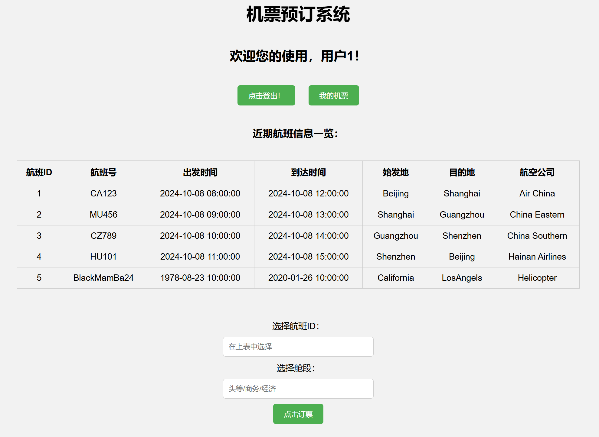

# LAMP_Flight_Booking
2024年10月数据库实验课大作业：基于LAMP的机票预订系统的开发归档。

> **环境需求**
> 
> - 系统版本：Linux Ubuntu 22.04
> - 数据库版本：MySQL 8.0.39-0ubuntu0.22.04.1
> - 网站服务器：Apache/2.4.52 (Ubuntu)
> - 前端/客户端：HTML5，CSS
> - 后端/服务端：PHP 8.1.2-1ubuntu2.18

使用方法：database.sql内有建库指令。数据库中仅用到了users表存储账户、ticket_infor存储机票信息、flight_infor存储航班信息，其他表涉及想做而未做的功能，删去不影响本系统运行。flight_infor.sql内为示例航班数据。

注意：在课程展示时，创建账户时应该按1、2、3、4……的顺序设定用户ID。

如果你正在突击应付作业，不会使用该项目，可前往开发者的博客：[https://testgames.me](https://testgames.me)，内有完整的WordPress建站、数据库管理零基础入门教程。